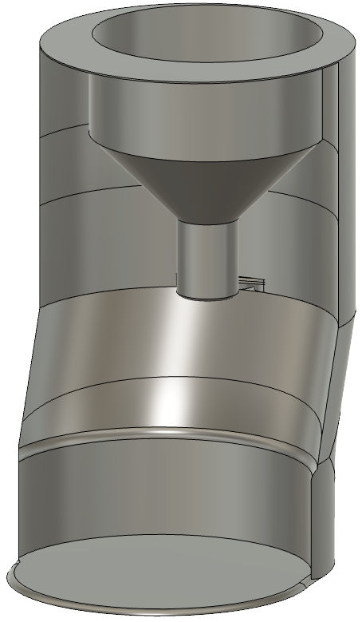
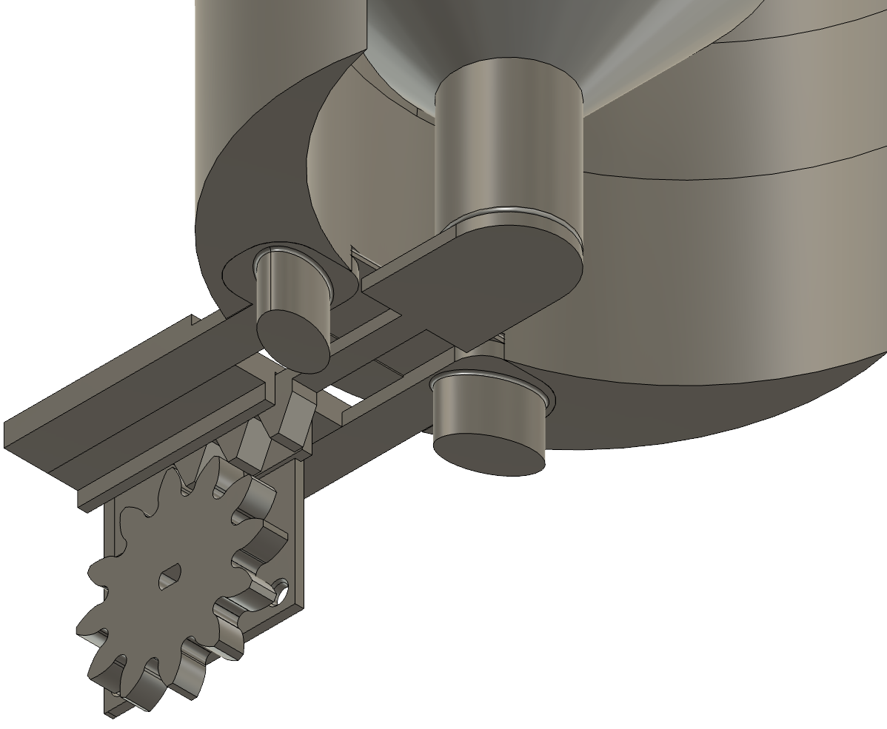

# Automatic-Cat-Feeder

Allows a Raspberry Pi to drive a motor which controls a food hopper.

## How to install
Run `pip install --upgrade pip setuptools wheel numpy` first, and then `apt-get install libhdf5-dev libatlas3-base libjasper-dev`. Finally, run `pip install -r requirements.txt` in root of repo.  
You must enable Legacy Camera support using `raspi-config`.

## How it works
-todo-

## How to setup
Hardware:
 - Raspberry Pi 3+ (tested with Raspberry 4 Model B)
 - A Raspberry Pi compatible 1080p camera
 - One limit switch
 - A ULN2003 stepper motor driver
 - A 28BYJ-48 5V stepper motor
 - Bright white LEDs
 - 3D printed parts, will release later

Install the camera in to the ribbon cable slot on the Raspberry Pi board.  
Wire up the limit switch to the respective pin you chose in `core.py`.  
Wire up the stepper motor to the motor driver.  
Wire the motor driver to the respective pins for the motor phases in `core.py`.  
Wire the white LEDs to the pin you chose in `core.py`.  
Place a platform on top of the limit switch.  
Mount the camera above the platform facing downward.  
Place the food bowl in the food shelf and position in front of platform.
